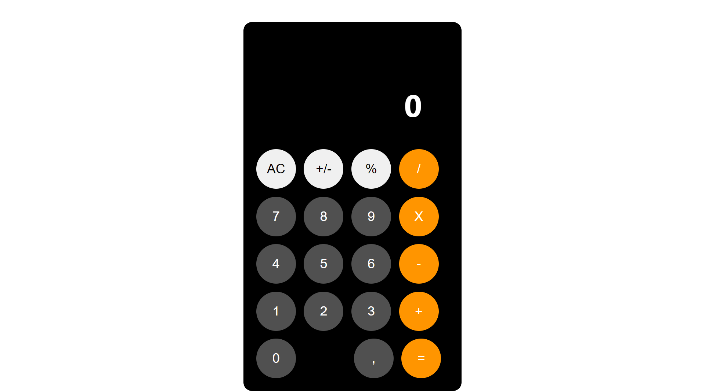

# Calculator-React



## Description

This is a simple calculator app built with React. It is a simple calculator that can add, subtract, multiply, and divide. It also has a clear button to clear the screen and a delete button to delete the last number entered.

## Table of Contents

- [Installation](#installation)
- [Usage](#usage)
- [License](#license)
- [Questions](#questions)

## Installation

To install necessary dependencies, run the following command:

```
npm install
```

## Usage

To use the app, simply click on the numbers and operators to perform calculations. Click the clear button to clear the screen and the delete button to delete the last number entered.

## License

This project is licensed under the MIT license.
